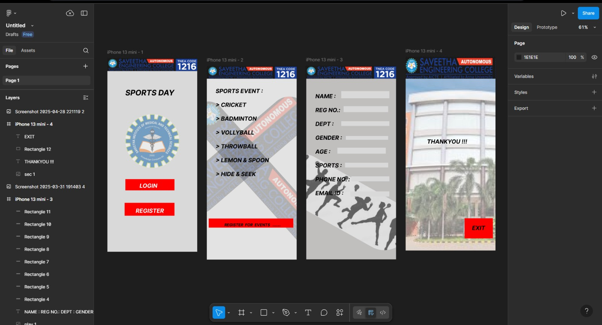

# Ex09 Event Registration Web Application
# Date:13-05-2025
# AIM:
To design, develop and deploy a web application for event registration.

# DESIGN STEPS:
## Step 1:
Create a new frame.

## Step 2:
Select any one preset size of your choice.

## Step 3:
Select the shapes you need.

## Step 4:
Import images as needed.

## Step 5:
Create pages based on your need and link them.

## Step 6:
Validate the HTML and CSS code.

## Step 6:
Publish the website in the given URL.

# DESIGN TOOL:
Figma

# CODE:
~~~
home page

    
HOME                ABOUT                  SERVICE               CONTACT           announcement             

    
    

    
    
    
SPORTS DAY

    
ARRIVING SOON...

    
    
Register your favourite sport 

    
Sweat   Conquer     Repeat !!   

main page

    
Sign Up

    
Fill out the given details

    

    

    

    
email 

    

    

    
password

    
user id 

    
Enter your name 

    
Phone number

    

    
sign up

    

    
By creating an account, I agree to the online library

    
Terms and conditions

    

    
Already have an account?

    
Sign in 

    

    

page2

    
    
 Login

    

    

    
Password

    
User Id

    
Forgot Password ?

    

    

    
New Account

    
Login

~~~
# OUTPUT:

# RESULT:
The program to design, develop and deploy a web application for event registration is completed successfully.
